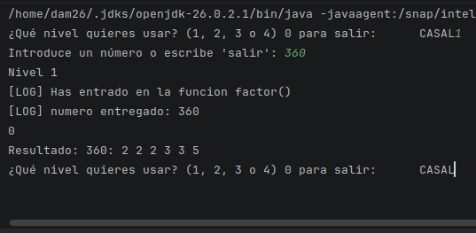
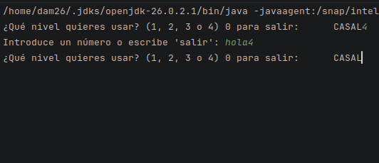
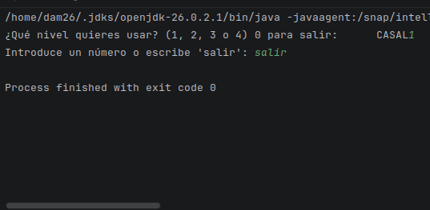
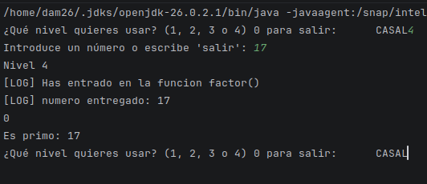
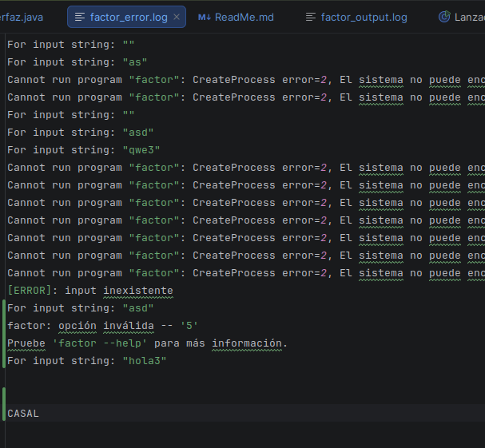
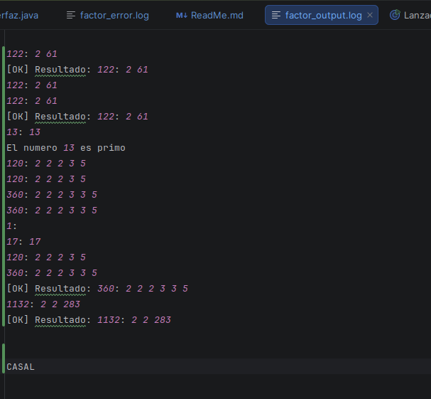
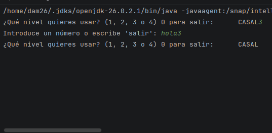
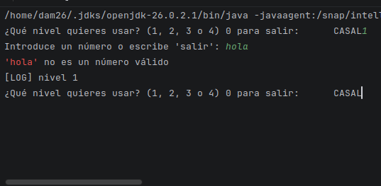

# Nivel 1, 2, 3 y 4

| Valor | Salida de Factor         | Código de Salida | 
| :--- |:------------------------------------|:-----------------|
| **360** |   	Resultado: 360: 2 2 2 3 3 5     | 0     | 
| **1** | Resultado: 1:         | 0      |
| **17** | Resultado: 17: 17          | 0      |
| **hola** | 'hola' no es un número válido |  ninguno |
| **-5** | Resultado: null     | 1    |

---

### Error tonto en el q mo olvide de poner el ``break;``

## Test correcto Nivel 1

## Test incorrecto Nivel 1

## Test salir

## Test correcto Nivel 2

## Test incorrecto Nivel 2

## Test correcto Nivel 3

## Test incorrecto Nivel 3

## factor_error.log

## factor_output.log 

## Test correcto Nivel 4

## Test incorrecto Nivel 4
